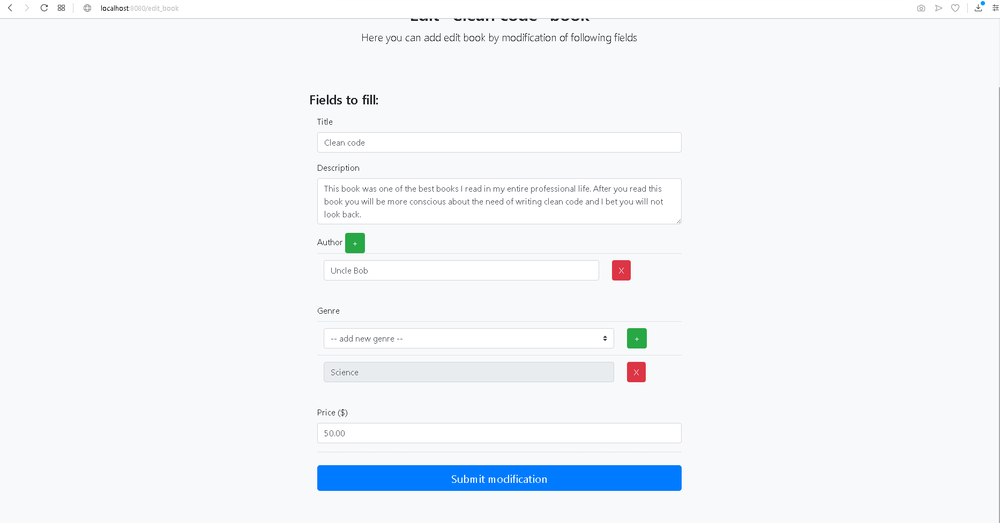

# Privectus Summer Java Internship test task
 
The application is based on Spring Boot Application and Spring MVC framework + Thymeleaf template.  
As database was used PostgreSQL 11 
Hibernate is being used as ORM. 
Build is being accomplished with help of Maven.   
 
I've not found an appropriate way how to integrate .htaccess file into my set-up,  
so i use Spring Security to access the admin web-interface but i still don't store  
admin username and password in database as was mentioned it task description.  
 
Default bootstrap templetes were used as Front-end.
 
## Result
To access admin web-interface you should enter the following url: 
localhost:8080 
 
To access user in web-interface you should enter the following url: 
locahost:8080/user 
 
### User
User can  

